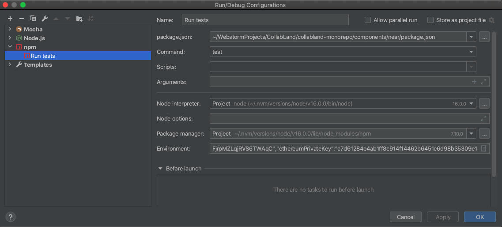

# 5. Testing

# Test Command

Each package.json has a `test` command that runs all test files in the `__test__` folder

To test run 

```json
npm test
```

# VS Code Debugger

[ 🚧 🚧 DOCUMENTATION UNDER CONSTRUCTION 🚧 🚧 ]

(Caleb has used the Webstorm debugger, wants to move this to VS Code)

** Webstorm Configuration.  VS Code seems to use a JSON configuration file instead.

TODO: Learn how to use the VS Code Debugger



## Debugger Benefits

Debugging is great because you can set break points and examine the instantaneous value of variables during execution.  running `npm test` in the terminal will tell you if the tests pass and the error that caused them to fail but doesn't lend much visibility.

# Environmental Variables

Work with Raymond to get an ENV variable into the AWS Keystore.

Place all variables in one object that is named after your component

Ex:

```json
export NEAR_TIPPING_CONFIG = {"contractId":"tipbot.ninja.testnet","publicKey":"ed25519:69xXmZJyxxxxxxxxxxxxxXEpsPC","privateKey":"ed25519:4NaSXs2RFQrgFxxxxxxxxxxxxxxxxjRVS6TWAqC","ethereumPrivateKey":"c7d61284e4ab1ffxxxxxxxxxxxxxx3a6c0a7963bde"}
```

# File Names

Tests ending in `.acceptance.ts`


# Personal Data

It may be necessary to use real Discord IDs in tests.  That's find, just don't name them after actual users.  This is fine.

```json
export const discordUserId2 = 'DIS#USER#330736597584576514';
```

# Expect vs Assert

Let's use `expect` instead of `assert`. The error messages from `assert` are not very helpful.

# Access Keys

If tests are failing for AWS Keychain rejection work with @Raymond Feng to get the correct AWS permissions

# How to Write Tests for A Job

1. Import the job
2. In before each create an instance of the job runner
3. Send a complete Job runner request to the `async run` function or send the request body to the inner service that `run` calls next

# Create Job Runner Instance

within `keys.ts` define a consistent name for your job

```jsx
export const NEAR_TIPPING_CHECK_BALANCE_JOB_RUNNER =
  BindingKey.create<NearTippingCheckBalanceJobRunner>(
    'services.NearTippingCheckBalanceJobRunner',
  );
```

Import that key into  your test file

```jsx
import {
  getNearApplication,
  NEAR_TIPPING_CHECK_BALANCE_JOB_RUNNER,
  NearWalletBalancesAndError,
} from '../../..';
```

Get that job runner by name from the `app`

```jsx
before(async () => {
    const app = await getNearApplication();
    jobRunner = await app.get(NEAR_TIPPING_CHECK_BALANCE_JOB_RUNNER);
  });
```

Call a specific function on that job runner

```jsx
it('return error no access key, request authorize key', async () => {
    const balanceResponse: NearWalletBalancesAndError =
      await jobRunner.checkTokenBalancesByUserId({
        userId: userWithoutNearAccountUserId,
      });
    expect(balanceResponse.error).to.containDeep({
      message:
        'Cannot check the balance of funds before linking your NEAR account to this community.',
    });
  });
```