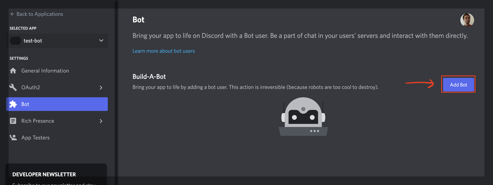
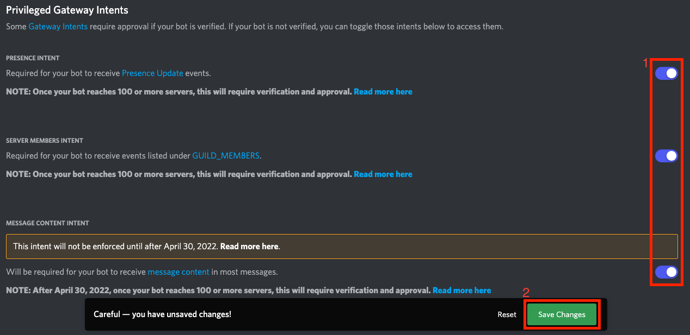
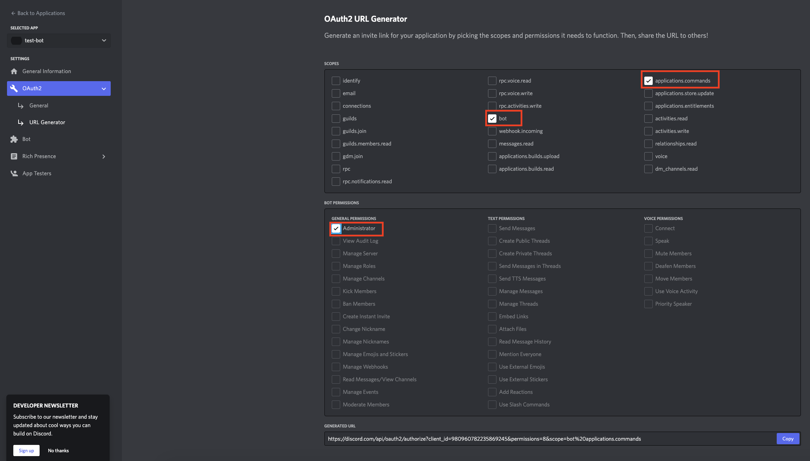

# Connect to Discord Bot

You can set up a Discord application to the [Collab.Land](http://Collab.Land) `api-server` by setting up the proper env variables

## Prerequisites

### Create a Discord Application

1. Navigate to [https://discord.com/developers/applications](https://discord.com/developers/applications) and select “New Application”

   

   Developers applications page

2. Follow the on screen instructions to create the application
3. Create a new bot
   
4. Navigate to the Bot page and activate all the intents

   

   “Privileged Gateway Intents” section on the Bot application page

## Set-Up

### Redis

Instructions can be found [here](./set-up-redis.md)

### Discord Events

This are the necessary variables for the `api-server` for the Discord Bot to run properly

```bash
export DISCORD_GUILD_ID=912...1678
export DISCORD_CLIENT_ID=9580...793152
export DISCORD_CLIENT_SECRET=MCf5sgk4...7Y197S3e
export DISCORD_BOT_TOKEN=OTU4MDc4MTU...kNpYLNAOcxo3eLxw
export DISCORD_PUBLIC_KEY=c3e29785f39ff...a68dbddac36cf4
```

### Discord Interactions

Interactions are necessary for some functionality of the bot like the join button in the `collabland-join` channel

In order to enable that feature you `api-server` will need to be available publicly online

💻 You can do so in local instance by adding the `—-local-tunnel` flag to the start script.
`node --enable-source-maps . --local-tunnel`
This will output on the console the following line indicating the public URL
`Local tunnel is started at https://collabland-xxx.loca.lt`


You will need to setup the public URL on the Discord’s developer portal

1. Head to the [https://discord.com/developers/applications](https://discord.com/developers/applications)
2. Select you application
3. Head to the “General Information” menu item on the side bar (if not already)
4. On the field listed as “INTERACTIONS ENDPOINT URL” enter you public’s instance URL and discord’s interaction path (e.g. `https://collabland-xxx.loca.lt/discord/interactions`)

   

   “INTERACTIONS ENDPOINT URL” field in “General Information” application page

## Link a Discord guild to the Bot and your User

### Add the bot to your Discord guild

Go to the URL Generator option in the Oauth tab of your app and make sure you pick the bot scope and application.commands
along with the Administrator permission for the bot

You can Go back to this screen and re-invite the bot at any time if you forgot to add the right scope and permissions

Copy the generated URL and access it through your preferred browser in order to invite the bot to your channel

### Validate the connection

In order to validate the link between the discord bot and the [Collab.Land](http://Collab.Land) infrastructure, we should check 2 things.

1. After the Discord bot have been added to the guild, the bot should automatically create 2 channels (`collabland-config` , `collabland-join`)

   

   Channel list after the bot have joined

2. The admin users that access `collabland-config` channel should be able to list their server under `/account/administrated-communities` endpoint of the [Collab.Land](http://Collab.Land) `api-server` by using Authentication (Discord accessToken or AE token)

### Adding commands to your bot
After inviting the bot to the channel you can proceed to add commands to the bot. Before using our cli  tool make sure you override with ENV vars the following : 
```bash
export COLLABLAND_ENV=<team-env>-<env> 
export AWS_ACCOUNT=352853905257 #This is the sandbox account

export DISCORD_GUILD_ID=XXXXXX
export DISCORD_CLIENT_ID=XXXXX
```
Then you can run 
```bash
npm run cli -- discord-application-commands
```

and select the commands you'll be adding to your bot
