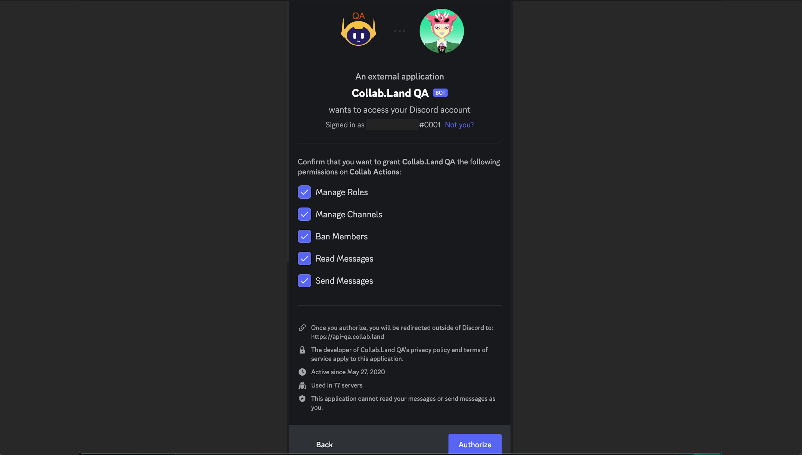
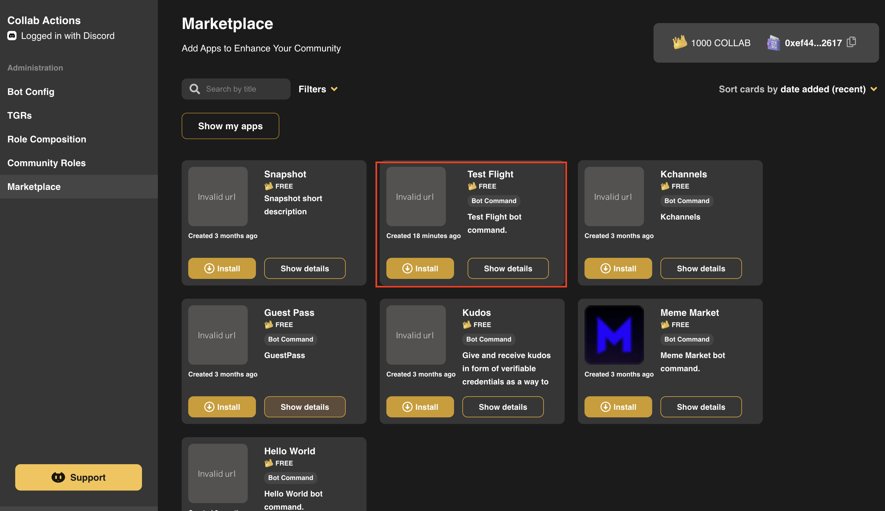

Collab.Land Actions is a set of tools for building and testing custom actions for Discord interactions. With Collab.Land Actions, the setup and configuration of the Collab.Land infrastructure, including Docker, AWS, authentications and securities, are handled for you by default.

To get started, use the `hello-action` [template provided on GitHub](https://github.com/abridged/collabland-hello-action/). This template provides a basic structure for building custom actions on top of the Collab.Land engine. Once your custom action is built, it can be run on a TestFlight mini-app within the Collab.Land QA bot to execute the business logic you've developed.

After testing, you can then install the action on your Discord server and test your implementation end to end without any oversight or dependency on Collab.Land. This allows for efficient contribution and extension to Collab.Land without the overhead of manual setup.

# Getting Started

This guide will walk you through the process of setting up and testing your first action using the `hello-action` template.

## Prerequisites

- Node.js and npm (Node Package Manager) must be installed on your system.

## Using the hello-action template

1. Fork the `hello-action` [template repository](https://github.com/abridged/collabland-hello-action/) from GitHub.
2. Clone the project.

```bash
git clone [PROJECT_URL.git]
```

1. Navigate to the project directory and install the project dependencies.

```bash
cd hello-action
npm install
```

1. Build the project

```bash
npm run build
```

1. To test the project, run the following command:

```bash
npm test
```

### Running template locally

To try out the project, you can run the `hello-action` server using the following command:

```bash
npm run server
```

By default, the server will generate an ECDSA key for signature verification between the client (signing the request payload) and the server (verifying the signature of the request).

To run the `hello-action` server with Collab.Land's public key for signature verification set the environment variable:

```jsx
export COLLABLAND_ACTION_PUBLIC_KEY=<public-key>
```

You can also use the following commands to run the server with different types of keys:

```bash
npm run server -- ecdsa
npm run server -- ed25519
npm run server -- <public-key>
```

When the server is running, it will output the signing key (including ecdsa: or ed25519:) in the console. You can copy this key and use it to run the hello-action test client.

### Running the `hello-action` test client

To run the `hello-action` test client, use the following command:

```bash
npm run client -- <server-signing-key>
```

## Next Steps

With the hello-action template set up, you can now start building and testing your own custom actions.

### Building Your Action

1. Use the `src/hello-action.ts` file as a template for your action.
2. Define the action metadata for Discord in the `getMetadata()` method. This includes information such as the name of the action, developer, version, and description.

```jsx
async getMetadata(): Promise<DiscordActionMetadata> {
    const metadata: DiscordActionMetadata = {
        manifest: new MiniAppManifest({
            appId: 'hello-action',
            developer: 'collab.land',
            name: 'HelloAction',
            platforms: ['discord'],
            shortName: 'hello-action',
            version: {name: '0.0.1'},
            website: 'https://collab.land',
            description: 'An example Collab.Land action',
        }),
        supportedInteractions: this.getSupportedInteractions(),
        applicationCommands: this.getApplicationCommands(),
    };
    return metadata;
}
```

3. Implement the `followup()` method to define the supported interactions and application commands for the action.

The `followup()` method takes in the `request` and `message` as arguments, it is used to build a follow-up message to accompany the initial response. In the example below, it checks for the existence of a callback URL and if it exists, it creates a follow-up message object, waits for 1 second and then sends it using the `followupMessage()` function. It then waits for another second and starts a countdown of 5 seconds.

```jsx
private async followup(
    request: DiscordActionRequest<APIChatInputApplicationCommandInteraction>,
    message: string,
  ) {
    const callback = request.actionContext?.callbackUrl;
    if (callback != null) {
      const followupMsg: RESTPostAPIWebhookWithTokenJSONBody = {
        content: `Follow-up: **${message}**`,
        flags: MessageFlags.Ephemeral,
      };
      await sleep(1000);
      let msg = await this.followupMessage(request, followupMsg);
      await sleep(1000);
      // 5 seconds count down
      for (let i = 5; i > 0; i--) {
        const updated: RESTPatchAPIWebhookWithTokenMessageJSONBody = {
          content: `[${i}s]: **${message}**`,
        };
        msg = await this.editMessage(request, updated, msg?.id);
        await sleep(1000);
      }
      // Delete the follow-up message
      await this.deleteMessage(request, msg?.id);
    }
  }
```

It then continues the countdown and sends an updated follow-up message with the remaining seconds in each iteration.

- `getSupportedInteraction()` — This function returns an array of supported interactions to provide routing guidance for Collab.Land to understand how to forward Discord interactions to this action.

```jsx
private getSupportedInteractions(): DiscordInteractionPattern[] {
    return [
      {
        // Handle `/hello-action` slash command
        type: InteractionType.ApplicationCommand,
        names: ['hello-action'],
      },
    ];
  }
```

In this case, it's set to handle the `/hello-action` slash command.

- `getApplicationCommands()` — This function returns an array of application commands, in this case, it's set to handle the `/hello-action <your-name>` slash command. It is required for Collab.Land to expose the action’s slash command in the Discord server.

```jsx
private getApplicationCommands(): ApplicationCommandSpec[] {
    const commands: ApplicationCommandSpec[] = [
      // `/hello-action <your-name>` slash command
      {
        metadata: {
          name: 'HelloAction',
          shortName: 'hello-action',
        },
        name: 'hello-action',
        type: ApplicationCommandType.ChatInput,
        description: '/hello-action',
        options: [
          {
            name: 'your-name',
            description: "Name of person we're greeting",
            type: ApplicationCommandOptionType.String,
            required: true,
          },
        ],
      },
    ];
    return commands;
  }
```

4. Implement the `handle()` method to process various Discord interactions. It takes in the `interaction` parameter which is an object that contains information about the interaction.

```jsx
protected async handle(
    interaction: DiscordActionRequest<APIChatInputApplicationCommandInteraction>,
  ): Promise<DiscordActionResponse> {
    // Get the value of `your-name` argument for `/hello-action`
    const yourName = getCommandOptionValue(interaction, 'your-name');
    const message = `Hello, ${
      yourName ?? interaction.user?.username ?? 'World'
    }!`;
    // Build a simple Discord message private to the user
    const response: APIInteractionResponse = buildSimpleResponse(message, true);
    // Allow advanced followup messages
    this.followup(interaction, message).catch(err => {
      console.error(
        'Fail to send followup message to interaction %s: %O',
        interaction.id,
        err,
      );
    });
    // Return the 1st response to Discord
    return response;
  }
```

This is where you implement your custom action logic. In this example, it calls a `getCommandOptionValue()` function to get the value of an argument called `your-name` from the interaction. Then it creates a message string by concatenating the `your-name` value with the text "Hello, " and if the `yourName` variable is null, it uses the `interaction.user?.username` or `'World'` as a fallback. After that, it creates a response object by calling the function `buildSimpleResponse()` with the message and a boolean value, which is used to build a simple message that is private to the user.

If you’ve gotten to this point, the expectation is that you’ve been able to do a few things:

- Clone the `hello-action` template and run it locally
- Customize the `hello-action` to implement your custom logic and functionality

# Deployment Guide

This guide provides instructions for deploying a locally built `action` to a public URL, making it accessible to Collab.Land.

> You can deploy your action like any other project to your preferred deployment platform. [Collab.Land](https://Collab.Land) does not enforce any particular deployment practices or platforms.

## Submitting Your Action

Once your action is built, you can [submit it for review](https://forms.gle/rTMmiXa8W7qUVA4f8) to Collab.Land. The metadata provided in the `getMetadata()` method will be reviewed to ensure there are no conflicts with other actions. Upon successful review and approval, the metadata will be saved in the action registry and frozen for that version.

## Setting Up the TestFlight Mini-App on Discord

This guide will walk you through the steps of installing and setting up the Collab.Land TestFlight mini-app to test your actions on a Discord server.

### Prerequisites

- A Discord account
- A Discord server to install and test the mini-app

### Installing the Collab.Land QA Bot on Discord

1. Sign in to Discord or [create a test Discord server.](https://support.discord.com/hc/en-us/articles/204849977-How-do-I-create-a-server-)
2. [Invite the QA Bot](https://api-qa.collab.land/discord/bot-invite) to your server where you would like to run your `action`.


1. Grant the required permissions:



Upon Authorization, you will be redirected to the Command Center. It is a password-protected site with:

- Username: `collabland` &
- Password: `nft1024`

To access the Command Center again, go to: [https://cc-qa.collab.land](https://cc-qa.collab.land)

### Creating a Community Wallet
<!-- why do they need to create a community wallet? -->
1. In the Command Center, go to the Marketplace tab.
2. Click on the "Create community wallet" button.
3. You will receive a message saying "Wallet successfully created” and access to the marketplace apps.


### Installing the TestFlight Mini-App

1. In the Marketplace tab, you will see all the available mini-apps, including `Test Flight`.
2. Click on the "Install" button for the Test Flight app.
3. The mini-app modal will pop up for you, click "Free Install" to install the app.



### Setting up the TestFlight Mini-App on Discord

Go to the Discord server in which you installed the [Collab.Land](https://Collab.Land) QA bot and type `/test` to see all the newly installed slash commands that are made available through the “Test Flight” mini app.


Select the `/test-flight install` option and enter the public action URL that you generated [here](https://www.notion.so/Create-Test-Flight-Mini-Apps-actions-on-Collab-Land-9ed73b509b4b4a459c8c901b4640c01a), in `action-url` field. For example, here we entered: [https://api-qa.collab.land/hello-action](https://api-qa.collab.land/hello-action)


You will get a message with a description of the `action` that you are about to install. Click the “Install the action” button. You will get a confirmation that the “action is installed”.


You and your users can now start using your `action` in the Discord server by running your slash commands!

<!-- For example, here `/hello-action` command is installed -->

<!-- %20on%20Collab%20L%209ed73b509b4b4a459c8c901b4640c01a/Untitled%207.png>)

%20on%20Collab%20L%209ed73b509b4b4a459c8c901b4640c01a/Untitled%208.png>)

%20on%20Collab%20L%209ed73b509b4b4a459c8c901b4640c01a/Untitled%209.png>)

%20on%20Collab%20L%209ed73b509b4b4a459c8c901b4640c01a/Untitled%2010.png>) -->

<!-- The above example shows a Hello World version of what you can do with Collab Actions. Here, once you enter `/hello-action your-name <NAME>`, you first get a “Hello, `<NAME>`!” Greeting message, then showing if your action needs any user permissions, you can list it and the user will have the option to approve or deny it. There is a 3rd follow-up message with a counter of 5 seconds and it disappears after that. This is all just to show what’s possible with Actions! -->

<!-- Please also note that in the above example, all the messages are [ephemeral messages](https://www.notion.so/Discord-Guest-Pass-29d94871d6cf4003ada2b80e258b15e8), you can also make your follow-up message(s) public if needed! -->
