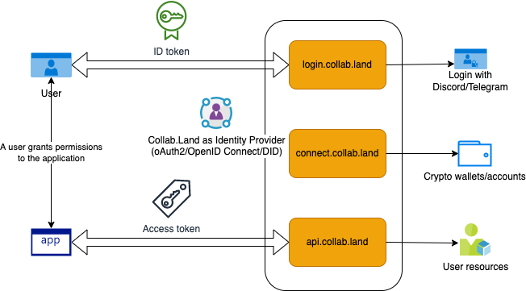
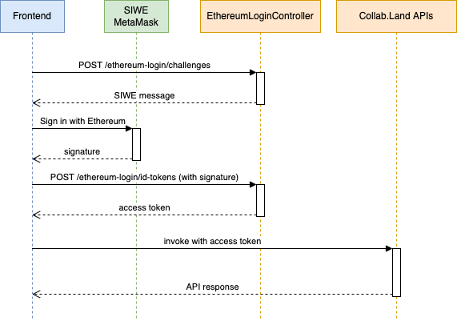
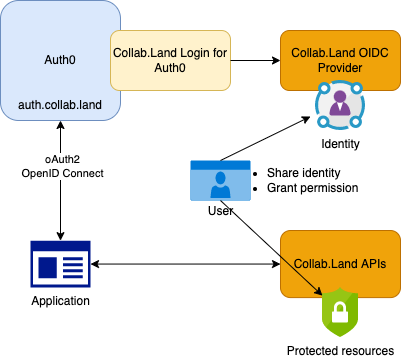

## Title

Login with Collab.Land

## Author

- Raymond Feng
  - Email: raymond@collab.land
  - Github: [@raymondfeng](https://github.com/raymondfeng)

## Created

2022-06-07

## Simple Summary

This submission proposes a `Login with Collab.Land` solution to support two
use cases:

- allow dApps to identify a user with its crypto accounts verified by Collab.Land
  wallet connections

- allow API clients to authenticate a user with Collab.Land and request their permissions
  to invoke Collab.Land APIs on behalf of the user.

## Abstract

Collab.Land allows users to be identified with the following methods:

- Login with the platforms, such as Discord, Telegram, Reddit, or Github
- Login with a custodial account, such as Dapper, Eluvio, Nifty Gateway
- Login with a non-custodial wallet, such as Metamask, Wallet Connect, Phantom,
  and Blocto

The features are available at https://connect.collab.land and https://login.collab.land.

The proposal is to improve the following components into a universal login
solution:

- Collab.Land login site
- Collab.Land wallet connections site
- Collab.Land backend to verify wallet connections
- Collab.Land backend as an identity provider to support oAuth2/OpenID Connect flow

## Motivation

Collab.Land has the potential to become a web3 identity provider with its growing
list of options to verify users' identities with various platforms, custodial accounts,
and non-custodial wallets. Such features have been built as wallet connections to connect
Discord/Telegram users with their crypto wallets/accounts that hold assets for token gating
purposes.

## Risks

`Login with Collab.Land` could present the following risks:

- Becomes a target for phishing
- Take responsibility to manage users' connected accounts

Mitigation:

## Opportunity

- Provide a powerful login experience with web3
- Ensure API security to protect users' data

## User Impact

[The User Impact identifies how the user will be impacted either through UI, UX, performance, value, or any other net positive or negatives of the proposed change. In under 1000 characters]
Example:

- Users will be able to enforce Multi-Factor Authentication (MFA)
- Users will get a universal CollabID across communities and platforms
- Users can use Collab.Land to share crypto wallet addresses with other DApps
- Users will be able to grant/revoke permissions to third party applications

## High level design

## Deliverables

1. Create an OpenID Connect provider for Collab.Land to generate ID tokens (`id_token`) for users
2. Create a CollabID (based on Gnosis safe) to unify all identifiers for the user
3. Improve `login.collab.land` site to support login with Collab.Land with crypto wallets
4. Leverage `connect.collab.land` site for authentications (UI and backend APIs)
5. Manage user identifiers on `user settings` page to control which providers can be used for login
6. Integrate with other DID providers such as Nuggets
7. Stretched: Build a PoC to integrate with Auth0

## Dependencies

Collab.Land teams will be needed to support the following areas:

- API Updates
- Backend Apps
- Design Updates
- FrontEnd Development

### Third party dependencies

- [Sign in with Ethereum](https://login.xyz/)

## Total Ask

## References

1. [Sign In With Ethereum (SIWE), Now Available on Auth0](https://auth0.com/blog/sign-in-with-ethereum-siwe-now-available-on-auth0/)
2. [SIWE Auth0 integration](https://marketplace.auth0.com/integrations/siwe)
3. [Self-Issued OpenID Provider V2 – (Optional) Enables End-users to use OpenID Providers (OPs) that they control](https://openid.net/specs/openid-connect-self-issued-v2-1_0.html)
4. [OpenID Connect for Verifiable Presentations – (Optional) Enables request and presentation of W3C Verifiable Presentations via OpenID Connect](https://openid.net/specs/openid-connect-4-verifiable-presentations-1_0.html)
5. [node-oidc-provider](https://github.com/panva/node-oidc-provider)
6. https://blog.spruceid.com/from-sign-in-with-ethereum-to-session-keys/
7. https://web3auth.io/docs/
8. https://auth0.com/blog/web3-sign-in-friction-with-web3auths-auth0-integration/
